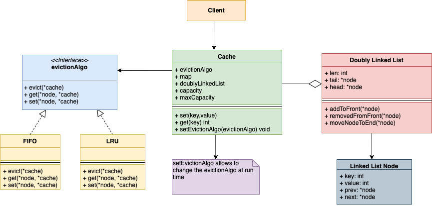

## 📌 1. What is Caching? Why is it Needed?

### **Definition:**

Caching is a technique used to store frequently accessed data in a temporary, high-speed storage layer to improve performance and reduce response time. Instead of fetching data from a slower storage medium (e.g., disk or database) or re-computing results, a cache retrieves the data quickly.

### **Why is Caching Needed?**

- 🚀 **Improves Performance:** Reduces the time taken to access frequently used data.
- ⚡ **Minimizes Load on Databases & Servers:** Prevents excessive queries and expensive computations.
- 🌍 **Enhances User Experience:** Faster response times in applications and web systems.
- 🛠 **Optimizes System Resources:** Reduces redundant processing and I/O operations.

---

## 📌 2. In-Memory Cache: Redis and Memcache Introduction

### **Redis (Remote Dictionary Server)**

- Open-source, in-memory key-value store.
- Supports **data structures** like strings, lists, sets, hashes, and sorted sets.
- Provides **persistence**, **replication**, and **pub/sub messaging**.
- Used for **real-time analytics, session storage, leaderboards**, and **caching database queries**.

### **Memcached**

- High-performance distributed memory caching system.
- Simple **key-value storage model**.
- **Stateless**, meaning no built-in persistence (data is lost when restarted).
- Used to **speed up dynamic web applications** by reducing database access.

---

## 📌 3. Cache Memory in Computer Organization

Cache memory is a small, high-speed memory that sits between the **CPU and RAM**, storing frequently accessed data and instructions.

### **Levels of Cache Memory**

1. **L1 Cache:** Smallest and fastest, located inside the CPU.
2. **L2 Cache:** Larger than L1 but slower, often inside or near the CPU.
3. **L3 Cache:** Shared among multiple CPU cores, larger but slower than L2.

### **Cache Mapping Techniques**

1. **Direct Mapped Cache:** Each memory block maps to a fixed location in the cache.
2. **Fully Associative Cache:** Any block can be placed in any cache slot.
3. **Set-Associative Cache:** A combination of the above two, dividing the cache into sets.

---

## 📌 4. Different Cache Replacement Strategies

When the cache is full, an item must be removed to accommodate new data. Different algorithms manage this process:

1. 🔹 **LRU (Least Recently Used)** – Evicts the least recently accessed item.
2. 🔹 **MRU (Most Recently Used)** – Removes the most recently accessed item.
3. 🔹 **FIFO (First-In-First-Out)** – Evicts the oldest cached item.
4. 🔹 **LFU (Least Frequently Used)** – Removes the item accessed the least number of times.
5. 🔹 **Random Replacement** – Randomly removes an item from the cache.

---

## 📌 5. Designing LRU Cache Using Doubly Linked List and HashMap

An **LRU Cache** can be efficiently implemented using:

- **Doubly Linked List (CDLL):** Maintains order of data access for quick updates.
- **HashMap:** Provides **O(1) time complexity** for lookups.

### **Operations:**

- **`put(key, value)`** → Inserts/updates a key-value pair.
- **`get(key)`** → Fetches a value and updates access order.
- **Eviction Policy** → If cache is full, the **least recently used (LRU) item is removed**.

---

## 📌 6. UML Diagram for LRU Cache Design

### **LRU Cache System UML Class Diagram**



### **Class Descriptions**

- **CDLLNode** → Represents a node in the circular doubly linked list.
- **CDLL** → Manages linked list operations (insertion, deletion, movement).
- **LRUCache** → Implements caching logic using a **CDLL** and **HashMap**.

---

## 📌 7. Java Code Implementation

### **LRU Cache Implementation using Circular Doubly Linked List (CDLL) and HashMap**

```java
import java.util.*;

class CDLLNode{
    int key, val;
    CDLLNode prev, next;

    public CDLLNode(int k, int v){
        this.key = k;
        this.val = v;
    }
}

class CDLL{
    CDLLNode head;

    public CDLL(){
        head = null;
    }

    CDLLNode insAtBegin(int k, int v){
        CDLLNode nn = new CDLLNode(k, v);
        nn.next = nn;
        nn.prev = nn;
        if(head == null){
            head = nn;
            return head;
        }
        CDLLNode last = head.prev;
        nn.next = head;
        head.prev = nn;
        last.next = nn;
        nn.prev = last;
        head = nn;
        return head;
    }

    int delLastNode(){
        if(head == null) return -1;
        if(head.next == head){
            int deletedKey = head.key;
            head = null;
            return deletedKey;
        }
        CDLLNode last = head.prev;
        CDLLNode befLast = last.prev;
        head.prev = befLast;
        befLast.next = head;
        return last.key;
    }

    void moveAtFront(CDLLNode nodeToMove){
        if(nodeToMove == head) return;
        nodeToMove.prev.next = nodeToMove.next;
        nodeToMove.next.prev = nodeToMove.prev;
        CDLLNode last = head.prev;
        nodeToMove.next = head;
        head.prev = nodeToMove;
        last.next = nodeToMove;
        nodeToMove.prev = last;
        head = nodeToMove;
    }
}

class LRUCache{
    int capacity, size;
    CDLL list;
    Map<Integer, CDLLNode> mp;

    public LRUCache(int capacity){
        this.capacity = capacity;
        this.size = 0;
        this.list = new CDLL();
        this.mp = new HashMap<>();
    }

    int get(int key){
        if(!mp.containsKey(key)) return -1;
        CDLLNode node = mp.get(key);
        list.moveAtFront(node);
        return node.val;
    }

    void put(int k, int v){
        if(mp.containsKey(k)){
            CDLLNode node = mp.get(k);
            node.val = v;
            list.moveAtFront(node);
        } else {
            if(size < capacity){
                CDLLNode node = list.insAtBegin(k, v);
                mp.put(k, node);
                size++;
            } else {
                int deletedKey = list.delLastNode();
                mp.remove(deletedKey);
                CDLLNode node = list.insAtBegin(k, v);
                mp.put(k, node);
            }
        }
    }
}

class Main {
    public static void main(String[] args) {
        LRUCache ch = new LRUCache(3);
        ch.put(0,0);
        ch.put(1,1);
        System.out.println(ch.get(3)); // Expected: -1 (Not Found)
        ch.put(3,3);
        System.out.println(ch.get(0)); // Expected: 0
        ch.put(4,4);
        System.out.println(ch.get(1)); // Expected: -1 (Evicted)
    }
}
```
